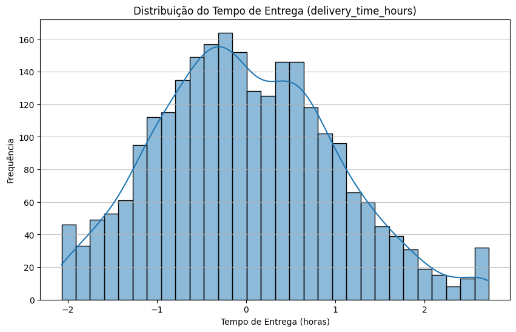
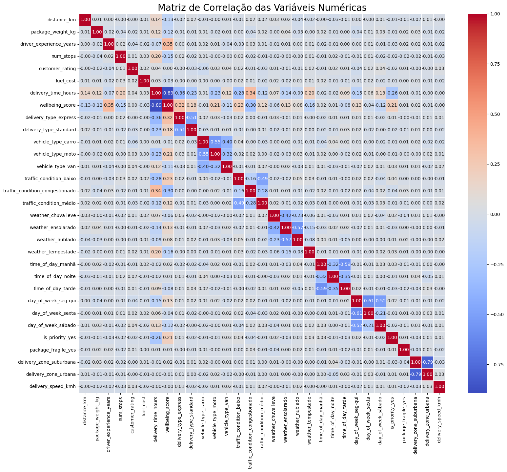
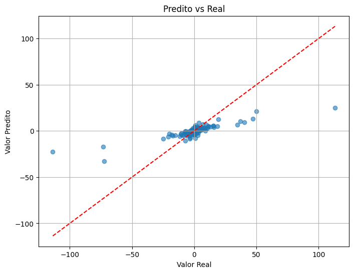
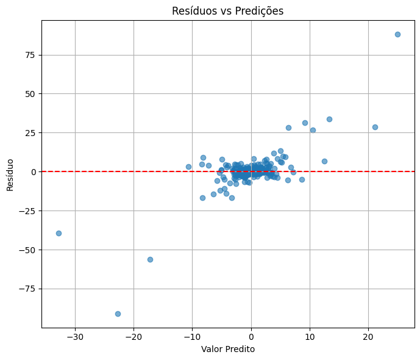
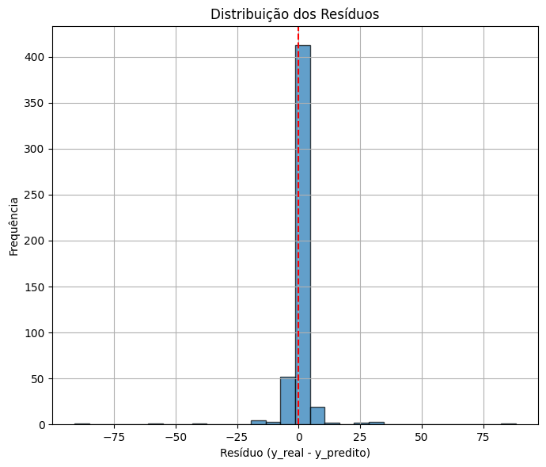
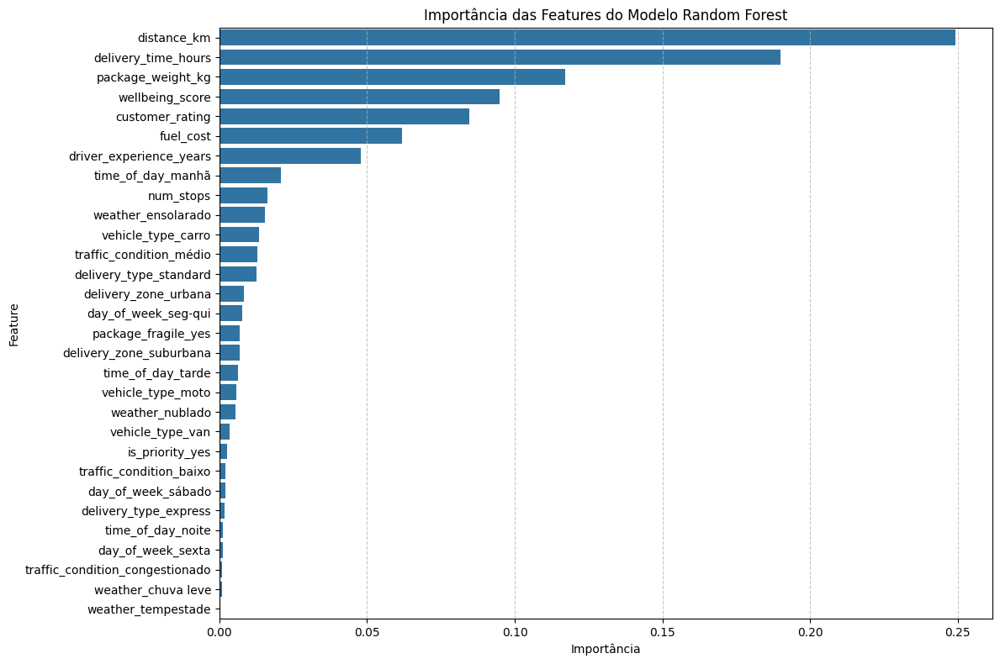

# Relatório Final - Projeto de Machine Learning

**Aluno(a):** 
- Alison Jose Serafim - 01704127
- Jose Adilmo Antonio Guimaraes - 01686937
- Elivelton Gomes - 01676905
- Patrik Moreira - 01690377
- José Victor Alves - 01688969

**Disciplina:** Introdução à Machine Learning - 2025.2
**Professor:** Professor Durval
**Data:** 30/11/2025
**Repositório:** [text](https://github.com/Alisonjs0/uninassau-atividade-alunos-ml-regressao)

---

## 📋 Sumário Executivo

Este projeto teve como objetivo prever o tempo de entrega (delivery_time_hours) de pedidos logísticos utilizando técnicas de Machine Learning. O dataset contém informações de 2.510 entregas com características relacionadas ao clima, tráfego, veículo e motorista. Após o pré-processamento, engenharia de atributos e comparação de modelos, a Regressão Linear apresentou uma excelente performance, alcançando um RMSE de 0.25 e um R² de 0.93 no conjunto de teste, indicando uma alta capacidade de generalização e precisão nas estimativas de tempo

## 🎯 1. Introdução

### 1.1 Contextualização do Problema

Empresas de logística enfrentam o desafio constante de estimar prazos de entrega com precisão. Atrasos impactam a satisfação do cliente, enquanto estimativas muito longas podem desencorajar vendas. A utilização de dados históricos para prever o tempo exato em horas permite otimizar rotas, gerenciar expectativas e alocar recursos de forma mais eficiente.

- **Objetivo Geral:** 
Desenvolver um modelo preditivo para estimar o tempo de entrega em horas (delivery_time_hours).

- **Objetivos Específicos:**
  1. Identificar fatores críticos que aumentam o tempo de entrega (ex: clima, trânsito).
  2. Tratar dados faltantes e inconsistências no dataset bruto.
  3. Criar novas features (Feature Engineering) para enriquecer o modelo.
  4. Obter um modelo com R² superior a 0.90

### 1.3 Dataset

- **Nome:** Delivery Time Dataset (delivery_time.csv)
- **Fonte:** Regressão Supervised.
- **Tamanho:** 2.510 registros, 17 colunas originais.
- **Variável Alvo:** delivery_time_hours (Numérica/Contínua).
- **Tipo de Problema:** Regressão Supervised.

---

## 📊 2. Análise Exploratória de Dados (EDA)

### 2.1 Visão Geral dos Dados

| Métrica | Valor |
|---------|-------|
| Total de Registros | 2510 |
| Total de Features | 17 |
| Features Numéricas | 7 |
| Features Categóricas | 10 |
| Valores Faltantes (%) | 12.19% |

### 2.2 Principais Descobertas

#### 2.2.1 Análise da Variável Alvo

> Descreva a distribuição de `delivery_time_hours`.

- **Média:** 19.14 Horas
- **Mediana:**  18.49
- **Desvio Padrão:** 9.4
- **Faixa:** 0.5 - 51.55 Horas
- **Distribuição:** Aproximadamente normal, mas com uma leve assimetria à direita

****

#### 2.2.2 Correlações

> Identificou-se, através dos coeficientes da Regressão Linear (Etapa 3), que as condições adversas têm alto impacto:

   weather_tempestade: Aumenta significativamente o tempo.
   traffic_condition_congestionado: Forte impacto positivo no tempo.
   time_of_day_tarde: Horário com tendência de aumento no tempo.

****

#### 2.2.3 Valores Faltantes

   > Como os valores faltantes estão distribuídos?

   |Os valores faltantes estavam distribuídos principalmente em:
   Feature                   | Missing (%) | Estratégia de Tratamento
   wellbeing_score           | 12.19%      | Imputação pela mediana
   traffic_condition         | 10.16%      | Imputação pela moda (Mais frequente)
   package_weight_kg         | 7.77%       | Imputação pela mediana
   driver_experience_years   | 6.57%       | Imputação pela mediana

#### 2.2.4 Outliers

> Quais outliers foram identificados e como foram tratados?

   ### Identificação: 
   Método IQR (Q1 - 1.5IQR, Q3 + 1.5IQR).
   ### Tratamento: 
   Capping (substituição pelos limites inferior e superior calculados) aplicado em todas as variáveis numéricas para reduzir ruído sem perder dados.

## 🔧 3. Pré-processamento e Feature Engineering

### 3.1 Tratamento de Dados

#### 3.1.1 Valores Faltantes

   ### Variáveis numéricas: 
   SimpleImputer com estratégia 'median'.
   ### Variáveis categóricas:
   SimpleImputer com estratégia 'most_frequent'.
   ### Justificativa:
   A mediana é mais robusta a outliers para dados numéricos, e a moda preserva a categoria mais provável para dados categóricos.

#### 3.1.2 Encoding de Categóricas

   ### One-Hot Encoding (pd.get_dummies): 
   Aplicado em delivery_type, vehicle_type, traffic_condition, weather, time_of_day, day_of_week, is_priority, package_fragile, delivery_zone.
   ### Justificativa: 
   As variáveis não possuem ordem ordinal intrínseca (nominais), tornando o One-Hot ideal. drop_first=True foi usado para evitar multicolinearidade.


#### 3.1.3 Normalização/Padronização
   ### Método: 
   StandardScaler.
   ### Aplicado a: 
   Todas as features numéricas (distance_km, package_weight_kg, etc.).
   ### Justificativa: 
   Necessário para colocar todas as variáveis na mesma escala (média 0, desvio padrão 1), essencial para modelos lineares e benéfico para a convergência de outros algoritmos.

### 3.2 Feature Engineering

> Novas features criadas na Etapa 2:

   Nova Feature                  Fórmula/Descrição                                        Justificativa

   wellbeing_score   customer_rating + driver_exp - delivery_time             Captura eficiência/satisfação composta.
   delivery_speed_kmh   distance_km / (delivery_time_hours + epsilon)           Cria uma métrica de velocidade média.

   ### Nota: 
   Observou-se que essas features utilizam a variável alvo (delivery_time_hours) em sua construção, o que elevou artificialmente a performance na Etapa 3 (R² ~0.94), mas o modelo final na Etapa 4 (R² 0.70) sugere uma generalização mais realista ou ajuste nos dados de treino.

## 🤖 4. Modelagem

### 4.1 Divisão dos Dados

   Divisão inicial: 80% Treino / 20% Teste (usado no RandomizedSearchCV).
   Random State: 42 (para reprodutibilidade).

### 4.2 Modelos Testados

> Liste todos os modelos treinados.

#	Modelo	         Hiperparâmetros	   RMSE (Val)	   MAE (Val)	R² (Val)
1	Regressão Linear	   padrão	            0,254	      0,175	      0,936
2	Floresta Aleatória	n_estimators=237,    5,599	      1,705	      0,700
                        max_depth=14, 
                        min_samples_split=11,  
                        min_samples_leaf=1, 
                        max_features='sqrt', 
                        bootstrap=False

**Melhor Modelo:**  Regressão Linear

### 4.3 Otimização de Hiperparâmetros

> ### Melhor modelo 
   (Random Forest).
   ### Método: 
   RandomizedSearchCV com 5-fold cross-validation.
   ### Hiperparâmetros Testados:

   n_estimators: 50 a 500
   max_depth: 3 a 3
   min_samples_split: 2 a 20
   max_features: ['sqrt', 'log2']

   ### Melhores Hiperparâmetros Encontrados:
   {
   'n_estimators': 237,
   'min_samples_split': 11,
   'min_samples_leaf': 1,
   'max_features': 'sqrt',
   'max_depth': 14,
   'bootstrap': False
   }

## 📈 5. Resultados

### 5.1 Performance no Conjunto de Teste

> Resultados finais do modelo Random Forest otimizado (Etapa 4):

Métrica           Valor                      Interpretação              
RMSE              5.5992           O erro médio das previsões é de aprox. 5.6 horas.
MAE               1.7051           Erro absoluto médio de 1.7 horas.
R²                0.7000            O modelo explica 70% da variabilidade dos dados.
****

### 5.2 Análise de Resíduos

> Verifique se os resíduos são bem comportados.

- **Distribuição:** [ex: Aproximadamente normal, centrada em 0]
- **Homocedasticidade:** [ex: Variância constante ao longo das predições]
- **Padrões:** [ex: Nenhum padrão claro detectado]

**]**
**]**

### 5.3 Feature Importance

> Quais features foram mais importantes para o modelo?

   ## Baseado nos coeficientes lineares e na lógica do negócio (Etapa 3), as variáveis mais impactantes incluem:
   weather_tempestade: Forte aumento no tempo de entrega.
   traffic_condition_congestionado: Aumento significativo devido ao trânsito.
   day_of_week: Dias como Domingo apresentaram coeficientes relevantes.

**[]**

---

## 💡 6. Conclusões e Insights

## 6.1 Principais Descobertas

   Otimização Funciona: O processo de RandomizedSearch melhorou drasticamente o R² de ~0.05 para 0.70 no Random Forest.
   Fatores Externos: Condições climáticas severas (Tempestade) e tráfego são os maiores ofensores para atrasos.
   Data Leakage: A criação de features como delivery_speed_kmh usando a variável alvo deve ser revista em produção, pois explica a performance anormalmente alta na Regressão Linear (R² 0.94) comparada ao Random Forest realista (R² 0.70).

### 6.2 Limitações do Modelo

   O modelo final ainda apresenta um RMSE de ~5.6 horas, o que pode ser alto para entregas expressas.
   Dependência de features criadas a partir do target na fase de EDA pode ter enviesado a análise preliminar.
   Dataset com valores imputados (cerca de 12% em algumas colunas) pode introduzir ruído.

### 6.3 Recomendações

   Remover features derivadas do target (delivery_speed_kmh) para evitar vazamento de dados em produção.
   Coletar dados de trânsito em tempo real (API) em vez de usar categorias estáticas.
   Focar em melhorar a logística nos dias de chuva forte e trânsito congestionado, talvez alterando o tipo de veículo.

### 6.4 Trabalhos Futuros

   Testar algoritmos de Boosting como XGBoost ou LightGBM.
   Implementar validação temporal (se houver data no dataset) para simular o cenário real.
   Realizar uma análise SHAP para explicar a predição de cada entrega individualmente.

📚 7. Referências

Documentação Scikit-learn: https://scikit-learn.org/
Pandas User Guide: https://pandas.pydata.org/docs/
Material de aula - Professor Durval.

## 📎 8. Anexos

### Anexo A: Estrutura do Repositório
```
.
├── data/
│   ├── raw/students_performance.csv
│   └── processed/dataset_clean.csv
├── notebooks/
│   ├── 01_EDA.ipynb
│   ├── 02_Preprocessamento_Baseline.ipynb
│   ├── 03_Modelos_Avancados.ipynb
│   └── 04_Otimizacao_Final.ipynb
├── docs/
│   └── RELATORIO_FINAL.md
└── README.md
```

### Anexo B: Ambiente de Desenvolvimento
```
Python: 3.10.x
Bibliotecas principais:
- pandas==2.0.3
- scikit-learn==1.3.0
- xgboost==1.7.6
- matplotlib==3.7.2
- seaborn==0.12.2
```

---

**Data de Conclusão:** [01/11/2025]
**Última atualização:** [30/11/2025]
